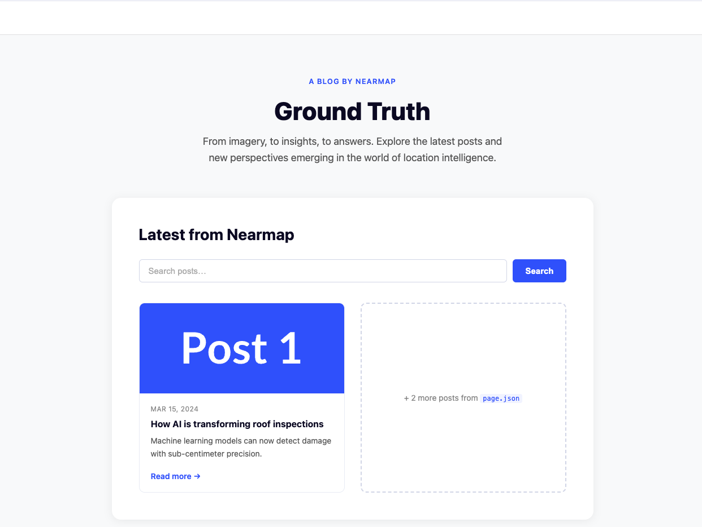

# Take-Home Test: CMS-Driven Block Renderer

At Nearmap, our marketing site is powered by a headless CMS. Content is structured as a list of **blocks** — each block is a JSON object with a `component` field that maps to a React component.

Build a simple app using NextJS.

Take a look at the [mock-wireframe.png](mock-wireframe.png) to get a feel for what we're after:




---

## The application should:

- Use TypeScript throughout.
- Load the page data from [`page.json`](page.json)
- Render a page at `/ground-truth` that matches the mockup
- Display a header section and a list of blog post cards below it
- Allow the user to search blog posts by title using a search input and button. Matching posts are shown; the rest are hidden. Clearing the input restores all posts.
- The content team creates and updates pages independently. The app should not need a developer to add a new page. The initial architecture should take this into account.

---

## Running your app

We would like to be able to run the following in the root of the project and have the app run locally:

```bash
npm install
npm run dev
```

If you have any further instructions, please include them in the project's `README.md`.

---

## Local development

Install dependencies and start the Next.js dev server:

```bash
npm install
npm run dev
```

Open [http://localhost:3000/ground-truth](http://localhost:3000/ground-truth) to view the CMS-rendered page.

Useful checks:

```bash
npm run typecheck
npm run test
npm run build
```

## Implementation notes

The page route is slug-based and renders blocks from `page.json` through a small component registry. Adding another CMS page should only require adding page data with a unique slug and supported block components.

## Submission instructions

- DO NOT fork this repository or create pull requests on it as we don't want other candidates to see your solution.
- Create a private repo by importing the https://github.com/nearmap/nearmap-web-test repo into a new private repo. (See https://github.com/new/import).
- Add us as a collaborator to the repo so we can see your solution. See your email for more details.
